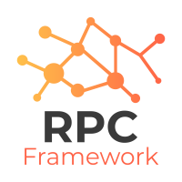

# CheckDot.RpcServer

Based On @therms/rpc-server



A _Remote Method Call_ framework for Javascript Node.js written in TS.

- JS/TS client (https://bitbucket.org/thermsio/rpc-client-ts)
- Android/Kotlin client (https://bitbucket.org/thermsio/rpc-client-kotlin)
- iOS/Swift client (https://bitbucket.org/thermsio/rpc-client-swift)

The goals of this RPC framework:

### Done:

✅ Provide a simple endpoint for clients to make RPC calls

✅ Provide a simple distributed server network of RPC handlers with minimal configuration

✅ Provide clients the ability to connect via WebSocket

✅ Provide automatic RPC handler API docs for client developers (via telemetry server data)

✅ Can optionally serve a telemetry client (html site)

✅ Provide clients with the ability to send "client messages" (over WebSocket) to the server

### Todo:

❌ Provide debugging & telemetry on all server info, statistics, status and processes via endpoint

```bash
npm i @therms/rpc-server
```

## Gateway Server (Node.js)

A "gateway server" is an entry-point server. In a distributed cluster of RPC servers, gateway
servers are used to provide a transport, HTTP or WebSocket, for clients (ie: browser, mobile app) to
make RPC calls.

### HTTP

A basic server that responds on HTTP to requests:

```js
const { CallResponse, CallRequest, RPCServer } = require('@therms/rpc-server')

const server = new RPCServer({
  displayName: 'rpc-gateway-1',
  gatewayServer: {
    http: { bind: 'localhost', port: 9876 },
  },
})

server.registerHandler({ method: 'login' }, async (request) => {
  if (
    request.args.email === 'test@test.com' &&
    request.args.password === 'secret'
  ) {
    return new CallResponse(
      {
        code: 200,
        data: { user: { name: 'Test' } },
        success: true,
      },
      request,
    )
  } else {
    return new CallResponse(
      {
        code: 403,
        message: 'Auth failed',
        success: false,
      },
      request,
    )
  }
})

server.start()
```

The RPC gateway server will now be available for RPC clients to make HTTP requests at:

`POST http://localhost:9876/` body = `{ method: 'test' }`

### WebSocket

RPC clients can also connect to a RPC gateway server via WebSocket:

```js
const server = new RPCServer({
  displayName: 'rpc-gateway-1',
  gatewayServer: {
    websocket: { bind: 'localhost', port: 9876 },
  },
})
```

> Note: Http & WebSocket servers cannot share the same `port` since the `HttpServer` in this
> framework uses **Http2** by default. WebSocket's are not easily supported over Http2, at this time.

#### WebSocket Connection Events

Listen when clients connect/disconnect:

```js
const server = new RPCServer({
  displayName: 'rpc-gateway-1',

  gatewayServer: {
    websocket: {
      bind: 'localhost',

      onClientConnect: ({ connectionId, identity, ip }) => {},

      onClientConnectionIdentityChanged: ({ connectionId, identity, ip }) => {},

      onClientDisconnect: ({ connectionId, identity, ip }) => {},

      onClientMessage: ({ connectionId, clientMessage, identity }) => {},

      port: 9876,
    },
  },
})
```

#### WebSocket Client/Server Messaging

The RPCServer provides a protocol for the RPC client to send messages to the RPC server and also the RPC server sending
messages to the clients. This communication only happens over active websocket connections.

The RPC client libraries implement the ability to send messages to the server with this websocket msg schema:
```js
{
    clientMessage: { anyDataStructure: 'any values' }
}
```

The RPC server provides a method for sending messages to websocket clients by `connectionId`:

```js
server.sendMessageToClient(connectionId, msg)
```

## Handler Server

A handler server is used in a distributed configuration to provide _method handlers_ to handle
a specific RPC. Handler servers sit usually behind the firewall and their only communication method
with other servers is via message broker. Our example uses RabbitMQ as the message broker.

> Note: If a gateway server is running and you expect the gateway server to manage calls to a
> handler server then the gateway server must be provided with `messageBroker.amqpURI` string
> so it can connect to the same message broker to communicate with the handler servers.

```js
const { CallResponse, RPCServer } = require('@therms/rpc-server')

const server = new RPCServer({
  displayName: 'rpc-handler-1',
  messageBroker: {
    amqpURI: 'http://my-rabbit-mq-host.com'
  }
});

server.registerHandler({ method: 'get-some-data', scope: 'some-specific-scope' }, async (request) => {
    const data = [...] // do some data fetching...

    return new CallResponse({
      code: 200,
      data,
      success: true,
    }, request);
});
```

## Handlers

### Call Request "args" Validation

The RPC server will vaidate the `CallRequest.args` received by client requests. The format
is JSON-schema (using the AJV library). Anytime a handler is registered with a JSON-schema
object in the `args` property, that schema will be used to perform validation, example:

```javascript
const server = new RPCServer({ ... });

const argsJsonSchema = {
    type: 'object',
    properties: {
        location_id: { type: 'string' }
    },
    required: ['location_id'],
    additionalProperties: false
}

server.registerHandler(
    {
        args: argsJsonSchema,
        method: 'get-users-for-location',
        scope: 'some-specific-scope'
    },
    async (request) => {
        const data = [...] // do some data fetching...

        return new CallResponse({
          code: 200,
          data,
          success: true,
        }, request);
    }
);
```

### Handler - Making Internal Calls

Registered RPC handlers can make RPC calls to other RPC handlers in the same network. A second param
is passed to the request handler to be used as a "client" making a RPC call. These calls are marked as `internal`
so they can access `internal` only handlers.

```javascript
const server = new RPCServer({ ... });

server.registerHandler(
  {
    internal: true, // this means that this RPC handler can only be accessed from internal calls
    method: 'get-all-locations',
    scope: 'internal'
  },
  async (request) => {
    return {
      code: 200,
      data: [...],
      success: true,
    };
  }
);

server.registerHandler(
    {
        method: 'get-list-of-locations',
        scope: 'public'
    },
    async (request, call) => {
        const { data } = call({ method: 'get-all-locations', scope: 'internal' })

        return new CallResponse({
          code: 200,
          data,
          success: true,
        }, request);
    }
);
```

### Listing for Error Events

You can optionally listen for error events in the server and/or your registered handlers.

```js
const server = new RPCServer({ ... });

server.on(RPCServer.events.handler_error, payload => {
  // log to Sentry/Bugsnag/etc.
})

server.on(RPCServer.events.rpc_server_error, payload => {
  // log to Sentry/Bugsnag/etc.
})
```

## Client Identity

The RPC server accepts an `identity` property with all RPC calls that contains information about the client's authentication info.

The identity property schema:

```typescript
{
  authorization: string
  deviceName?: string
  metadata?: { [string]: any }
}
```

#### Http Client Requests

All HTTP RPC requests are stateless on the server. The server implementation requires the `identity` prop to be sent with every RPC call (when the `identity` information is required for a specific **method**).

#### WebSocket Connections

WebSocket connections are long-lived and remain open. For this reason, the `identity` information only needs to be sent **once** per WebSocket connection. The server will keep the `identity` information for the client WebSocket connection for as long as the connection remains active. The client connection must re-send the `identity` information if the WebSocket is disconnected and reconnected.

The client can set the WebSocket connection `identity` over WebSocket by sending this payload:

```typescript
{
  identity: {
    authorization: 'some-jwt-string'
  }
}
```

When the server's WebSocket connection handler receives a message with only the `identity` property, it will assume the client is setting it's identity and does not expect a valid `scope`, `method` or `version`.

After the `identity` is set by the client for the WebSocket connection, all sebsequent RPC's are not required to send the `identity` property as long as the connection WebSocket remains alive.

### Handlers & Identity

The client's `identity` for each request is available in the handler, example:

```javascript
server.registerHandler(
  { method: 'do-something-restricted', scope: 'restricted' },
  (request) => {
        const { authorization, deviceName, metadata } = request.identity

        if (!authorization || jwtService.isValid(authorization)) {
            throw new CallResponse({ code: 401, message: 'unauthorized', success: false }, request)
        }

        ...
    }
)
```

> Note: Regarding the Client library implementations (Javascript, Kotlin, Swift) of WebSocket transports --
> The lib implementation only needs to send the Identity once, after the WebSocket
> connects to the remote. The remote will remember the WS identity. If the WS disconnects
> and reconnects, the client lib must immediately send the identity again.

## Debug Logs

This project uses the npm `debug` package. Set your env VAR to check debug logs:

```
export DUBUG=rpc:*
```

or
`DUBUG=rpc:* nodemon server.js`
